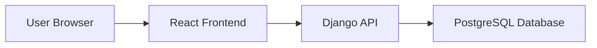
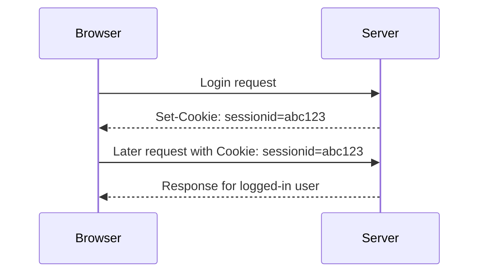
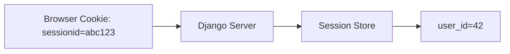
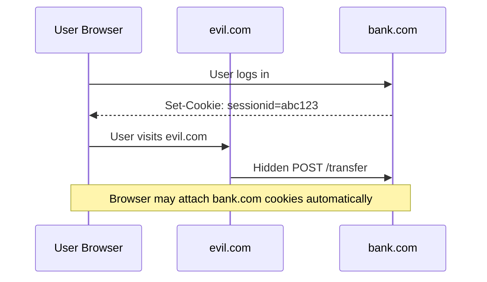
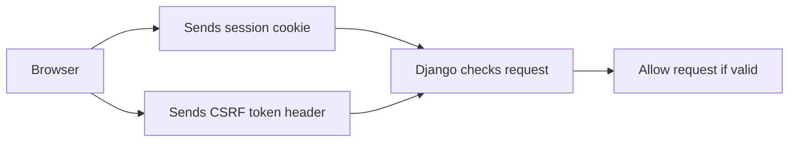
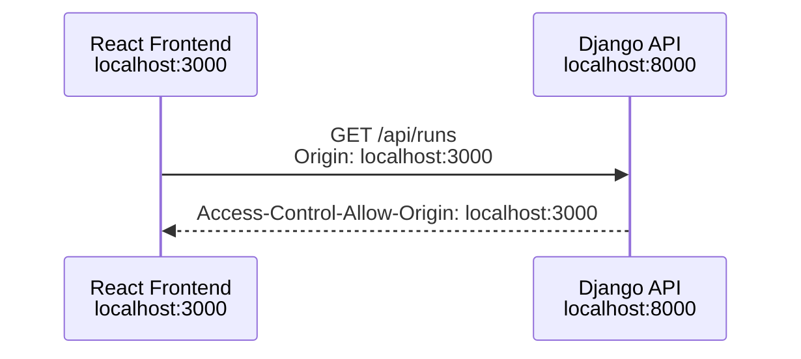
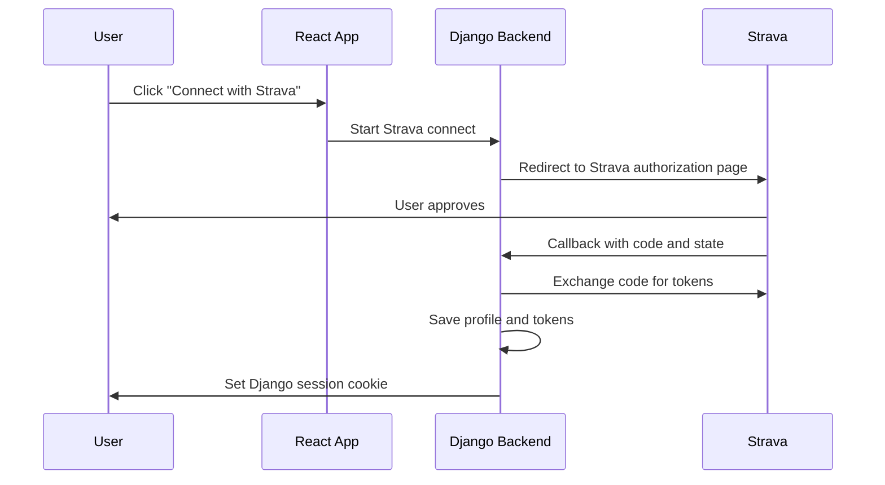
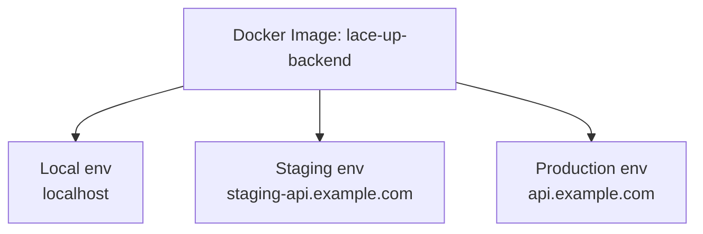

# Web Security and Networking Basics

Simple notes for understanding how a React frontend talks to a Django backend with cookies, sessions, CSRF, CORS, and OAuth.

The goal is not to memorize every detail. The goal is to understand what happens between the browser and the server.

## 1. The Big Picture

Your app has two main sides:

```txt
React frontend  <---- HTTP ---->  Django backend
Browser                         Server
```

In production, it may look like this:

```txt
User Browser
    |
    v
React App on CloudFront/S3
    |
    v
Django API on AWS
    |
    v
Database
```

Mermaid version:



## 2. HTTP Request and Response

Every browser-server interaction is a request and a response.

```txt
Browser sends request
Server sends response
```

Example:

```http
GET /api/me HTTP/1.1
Host: api.example.com
Cookie: sessionid=abc123
```

Response:

```http
HTTP/1.1 200 OK
Content-Type: application/json

{"username": "runner_123"}
```

Common HTTP methods:

| Method | Meaning |
|---|---|
| `GET` | Read data |
| `POST` | Create data or trigger an action |
| `PUT` | Replace data |
| `PATCH` | Update part of data |
| `DELETE` | Delete data |

Important rule:

```txt
GET should not change server state.
```

Bad:

```txt
GET /api/delete-account
```

Good:

```txt
POST /api/delete-account
```

## 3. Cookies

A cookie is a small value stored by the browser.

The server sets it:

```http
Set-Cookie: sessionid=abc123; HttpOnly; Secure; SameSite=Lax
```

The browser sends it later:

```http
Cookie: sessionid=abc123
```

Picture:



Key cookie attributes:

| Attribute | Meaning |
|---|---|
| `HttpOnly` | JavaScript cannot read the cookie |
| `Secure` | Cookie is only sent over HTTPS |
| `SameSite` | Controls when cookies are sent across sites |
| `Domain` | Which domains receive the cookie |
| `Path` | Which URL paths receive the cookie |

Simple mental model:

```txt
Cookies are automatically attached by the browser.
That is convenient, but it is also why CSRF exists.
```

## 4. Sessions

A session means the server remembers who the user is.

The browser only stores a session ID.

```txt
Browser cookie:
sessionid=abc123

Server session table:
abc123 -> user_id=42
```

Picture:



Session login flow:

```txt
1. User logs in.
2. Django verifies the user.
3. Django creates a session.
4. Django sends sessionid cookie to browser.
5. Browser sends sessionid on future requests.
6. Django uses sessionid to identify the user.
```

In this project, Strava login eventually calls:

```python
login(request, user)
```

That creates a Django session for the browser.

## 5. HttpOnly, Secure, and SameSite

These three are very important for cookie security.

### HttpOnly

```txt
JavaScript cannot read the cookie.
```

Good for session cookies.

If an attacker injects JavaScript, `HttpOnly` makes it harder to steal the session cookie directly.

### Secure

```txt
Cookie is only sent over HTTPS.
```

Production should use:

```python
SESSION_COOKIE_SECURE = True
CSRF_COOKIE_SECURE = True
```

### SameSite

`SameSite` controls whether cookies are sent in cross-site situations.

| Value | Meaning |
|---|---|
| `Lax` | Good default. Blocks many cross-site POST cookie sends |
| `Strict` | Very restrictive. Can break login redirects |
| `None` | Allows cross-site cookies, but requires `Secure` |

Production default for many apps:

```env
SESSION_COOKIE_SAMESITE=Lax
```

If frontend and backend are truly on unrelated domains, you may need:

```env
SESSION_COOKIE_SAMESITE=None
SESSION_COOKIE_SECURE=True
```

## 6. CSRF

CSRF means Cross-Site Request Forgery.

It means:

```txt
A bad website tricks the user's browser into sending a request to your website.
```

Why it works:

```txt
Browsers automatically send cookies.
```

Example:



The server might think the request is real because it contains the user's cookie.

## 7. CSRF Protection

CSRF protection usually uses a CSRF token.

The idea:

```txt
Cookie alone is not enough.
The frontend must also send a secret CSRF token.
```

Example:

```http
POST /api/runs/
Cookie: sessionid=abc123; csrftoken=xyz789
X-CSRFToken: xyz789
```

Picture:



Simple rule:

```txt
For cookie-based authentication, protect POST/PUT/PATCH/DELETE with CSRF checks.
```

## 8. CORS

CORS means Cross-Origin Resource Sharing.

It answers this browser question:

```txt
Can JavaScript from this frontend origin read the API response?
```

An origin is:

```txt
scheme + host + port
```

Examples:

```txt
http://localhost:3000
http://localhost:8000
https://app.example.com
https://api.example.com
```

These are different origins:

```txt
http://localhost:3000
http://localhost:8000
```

Picture:



If the API does not allow the frontend origin, the browser blocks the frontend from reading the response.

Important:

```txt
CORS is enforced by browsers.
curl and Postman do not care about CORS.
```

## 9. CORS With Cookies

If your React app uses Django session cookies, the request must include credentials.

Axios:

```js
axios.get(url, {
  withCredentials: true,
});
```

Fetch:

```js
fetch(url, {
  credentials: "include",
});
```

The Django API must allow credentials:

```python
CORS_ALLOW_CREDENTIALS = True
```

And it must allow the exact frontend origin:

```python
CORS_ALLOWED_ORIGINS = [
    "http://localhost:3000",
]
```

Do not use this with cookies:

```http
Access-Control-Allow-Origin: *
Access-Control-Allow-Credentials: true
```

Why?

```txt
Credentialed CORS requires a specific origin, not "*".
```

## 10. CORS vs CSRF

These are easy to mix up.

| Topic | Question it answers |
|---|---|
| CORS | Can frontend JavaScript read the API response? |
| CSRF | Is this state-changing request intentionally made by the real site? |

Simple diagram:

```txt
CORS = browser read permission
CSRF = request authenticity protection
```

CORS does not replace CSRF.

A bad site may not be able to read the response, but it may still try to trigger a request.

## 11. OAuth

OAuth lets users authorize your app without giving your app their password.

For this project, Strava OAuth works like this:



Important OAuth rules:

```txt
The client secret stays on the backend.
The redirect URI must match exactly.
The state value protects the login flow.
Access and refresh tokens should not be exposed to the frontend.
```

In this project:

```txt
BACKEND_URL determines the Strava callback URL.
```

Example:

```env
BACKEND_URL=https://api.yourdomain.com
```

Callback:

```txt
https://api.yourdomain.com/api/strava/callback/
```

## 12. Important Django Settings

These settings matter for browser auth and deployment.

| Setting | Purpose |
|---|---|
| `ALLOWED_HOSTS` | Which hostnames Django accepts |
| `CORS_ALLOWED_ORIGINS` | Which frontend origins may call the API |
| `CORS_ALLOW_CREDENTIALS` | Whether cookies are allowed in CORS requests |
| `CSRF_TRUSTED_ORIGINS` | Which origins are trusted for CSRF checks |
| `SESSION_COOKIE_SECURE` | Send session cookie only over HTTPS |
| `CSRF_COOKIE_SECURE` | Send CSRF cookie only over HTTPS |
| `SESSION_COOKIE_SAMESITE` | Control cross-site cookie behavior |

Local example:

```env
ALLOWED_HOSTS=localhost,127.0.0.1
CORS_ALLOWED_ORIGINS=http://localhost:3000,http://127.0.0.1:3000
CSRF_TRUSTED_ORIGINS=http://localhost:3000,http://127.0.0.1:3000
SESSION_COOKIE_SECURE=False
SESSION_COOKIE_SAMESITE=Lax
```

Production example:

```env
DEBUG=False
ALLOWED_HOSTS=api.yourdomain.com
BACKEND_URL=https://api.yourdomain.com
FRONTEND_URL=https://yourdomain.com
CORS_ALLOWED_ORIGINS=https://yourdomain.com
CSRF_TRUSTED_ORIGINS=https://yourdomain.com
SESSION_COOKIE_SECURE=True
CSRF_COOKIE_SECURE=True
SESSION_COOKIE_SAMESITE=Lax
```

## 13. Why Use Environment Variables?

Environment variables let the same Docker image work in different places.

```txt
Same code
Same Docker image
Different environment variables
Different deployment environments
```

Picture:



That is why settings like `ALLOWED_HOSTS`, `CORS_ALLOWED_ORIGINS`, and `CSRF_TRUSTED_ORIGINS` should come from env vars.

## 14. Common Mistakes

Avoid these:

```txt
DEBUG=True in production
ALLOWED_HOSTS=* in production
CORS_ALLOW_ALL_ORIGINS=True with cookies
Putting OAuth client secret in frontend code
Storing secrets in Git
Using HTTP in production
Forgetting SESSION_COOKIE_SECURE=True in production
Thinking CORS replaces CSRF
Using GET for state-changing actions
```

## 15. Mental Checklist

When debugging auth, cookies, or CORS, ask:

```txt
Is the browser sending the cookie?
Is the cookie blocked by SameSite or Secure?
Is the frontend using withCredentials / credentials: "include"?
Does Django allow this frontend origin in CORS_ALLOWED_ORIGINS?
Does Django trust this origin in CSRF_TRUSTED_ORIGINS?
Is the request POST/PUT/PATCH/DELETE and missing a CSRF token?
Is BACKEND_URL correct for OAuth callback?
Is the production site using HTTPS?
```

## 16. Interview Summary

Short version:

```txt
This app uses Django session authentication with cookies. The browser stores a session cookie after Strava OAuth login, and sends it on future API requests. Because cookie auth is automatic, the app needs CSRF protection for unsafe requests. Since the React frontend and Django API may run on different origins, CORS must explicitly allow the frontend origin and credentials. In production, HTTPS, Secure cookies, correct SameSite behavior, and environment-based configuration are required.
```
